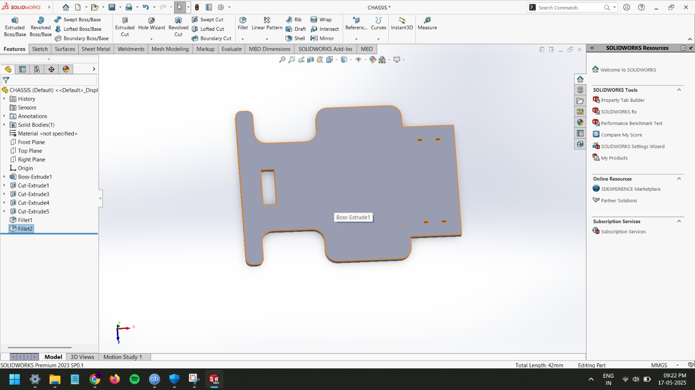

# ESP32-Based Wi-Fi Controlled RC Car 🚗📡

## Overview
This project demonstrates the design and fabrication of a Wi-Fi controlled RC car using an ESP32 microcontroller. The chassis was custom-designed in SolidWorks and optimized for 3D printing.

**Skills Used:** SolidWorks, 3D Printing, Embedded Systems, Arduino IDE  
**Tools:** SolidWorks, ESP32, FDM 3D Printer, Fusion 360 (optional)  

---

## Features
- Real-time Wi-Fi control via a custom web interface
- ESP32 microcontroller with low-latency motor control
- Integration of mechanical and electronic systems

---

## CAD Model

---

## Demonstration Video
[▶ Watch on YouTube](https://youtu.be/FggS_ierqAI)  

---

## Project Report
[📄 Download PDF](assets/project-report.pdf)

---

## How It Works
1. The ESP32 hosts a local web server accessible over Wi-Fi.
2. Motor driver receives commands from the ESP32.
3. The 3D-printed chassis houses all electronics and ensures structural stability.

